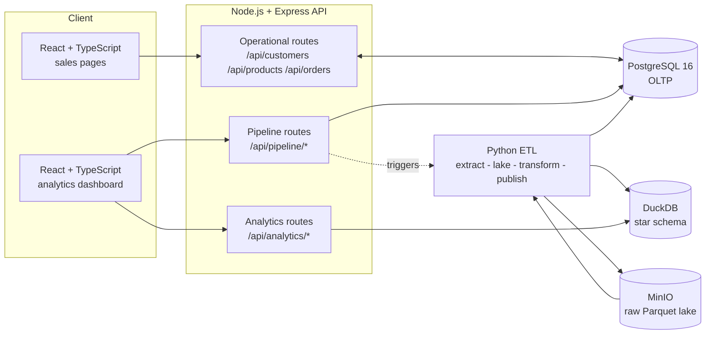
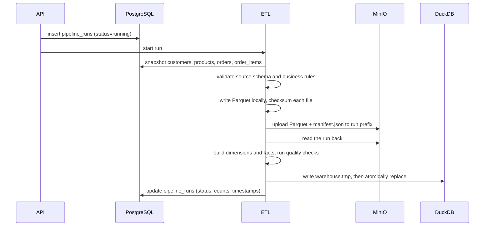
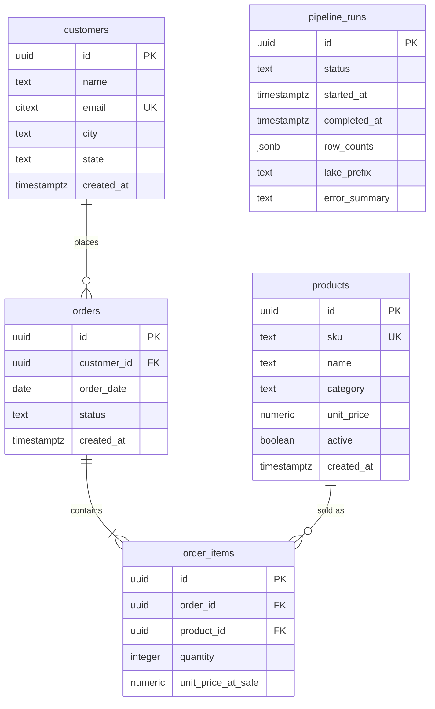
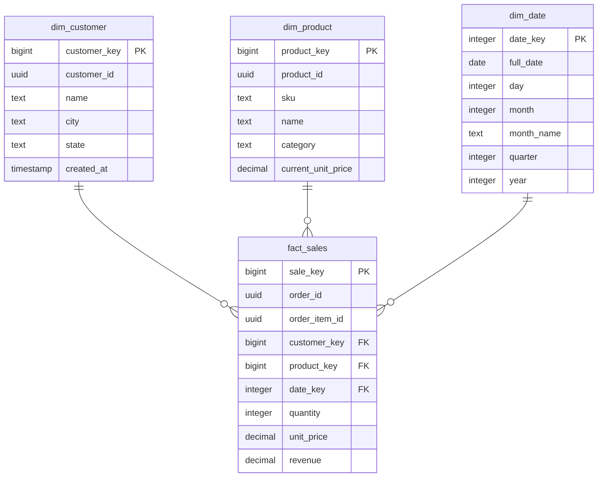

# Architecture

This document describes the component boundaries, how data moves between them,
the schemas at each layer, and the trade-offs behind each choice. It is the
companion to [docs/api/openapi.yaml](docs/api/openapi.yaml), which owns
the request/response contract.

## 1. Component boundaries



Each store has exactly one responsibility, and the arrows above are the only
permitted ones:

| Component | Owns | Must never |
|---|---|---|
| PostgreSQL | Transactional truth for customers, products, orders, order items and pipeline run audit | Serve an analytics endpoint |
| MinIO | Immutable, run-partitioned raw extracts | Be mutated in place, or be read by the API |
| DuckDB | Analytical star schema | Be written by the API, or be the system of record |
| API | HTTP contract, validation, transactions, warehouse reads | Compute analytics from PostgreSQL as a fallback |
| ETL | The only writer of the lake and the warehouse | Write application tables other than `pipeline_runs` |

The rule worth restating, because it is the one an implementation is most
tempted to break: **when the warehouse is missing, analytics endpoints return
zeros with `warehouseReady: false`.** They do not silently query PostgreSQL.
A fallback would make the dashboard look correct while erasing the very
separation this system exists to demonstrate.

## 2. Data movement

One pipeline run is a single, auditable unit of work:



Deliberate properties of this flow:

- **Extract reads a consistent snapshot.** All four source tables are read in
  one repeatable-read transaction so an order cannot appear without its items.
- **The lake is written before the warehouse.** The warehouse is rebuilt *from
  the lake*, not from PostgreSQL, so the lake is a genuine dependency rather
  than a decorative copy.
- **Publication is atomic.** The temporary DuckDB file is renamed over the
  published one only after every quality check passes; a reader never sees a
  half-built star schema.
- **Failure is recorded, not hidden.** `pipeline_runs` keeps a sanitised error
  summary so a failed run is visible in the UI without leaking credentials.

## 3. Operational schema (PostgreSQL)



Constraints that carry design meaning:

- `order_items` exists even though the brief mentions only orders. A real order
  contains several products, and one row per sold line is exactly the grain the
  warehouse fact table needs.
- `unit_price_at_sale` is stored per line. Without it, editing a product price
  would silently rewrite last quarter's revenue.
- `quantity > 0` and `unit_price_at_sale >= 0` are database-level checks, not
  only Zod checks, so bad rows cannot arrive through any path.
- `email` and `sku` are unique, giving the ETL stable natural keys to build
  dimensions from.
- `pipeline_runs` lives in PostgreSQL rather than the warehouse because it is
  operational state about the platform, and it must survive the warehouse file
  being replaced.

Money uses `numeric`, never floating point.

## 4. Lake layout and immutability policy

```text
s3://sales-lake/
  raw/
    run_date=2026-08-18/
      run_id=1f0c2c1e-2a4b-4b8e-9c1a-6d5f8e2b7a30/
        customers.parquet
        products.parquet
        orders.parquet
        order_items.parquet
        manifest.json
```

- **Append-only.** A new run creates a new `run_id` prefix. No run ever writes
  to a prefix another run created.
- **Versioning is enabled on the bucket** by `infra/minio/create-bucket.sh`, so
  even an accidental overwrite leaves the original object retrievable.
- **`manifest.json` makes a run auditable**, recording source row counts, a
  SHA-256 checksum per file, the extraction timestamp, the schema version and
  the generator/pipeline version. It is what distinguishes a data lake from a
  directory of temporary files.
- **Parquet, not CSV or JSON.** Columnar, typed, compressed and directly
  scannable by DuckDB — the raw layer stays cheap to keep and cheap to re-read.
- The API has no lake credentials. Only the ETL reads and writes it.

## 5. Warehouse schema (DuckDB)



- **Grain:** one `fact_sales` row per sold order item. Order-level measures are
  derived by aggregating on `order_id`, which keeps product-level analysis
  possible without a second fact table.
- **Cancelled orders are not facts.** A cancelled order is not a sale, so counting
  it would inflate every published revenue figure by the cancellation rate. Those
  rows remain in PostgreSQL and in the lake permanently — they are simply excluded
  from `fact_sales`. The completeness check therefore compares the fact count
  against *non-cancelled* source items; comparing against all of them would fail
  by exactly the cancellation rate and let a real completeness bug hide behind an
  expected gap. The published file records the rule in
  `warehouse_metadata.excluded_order_statuses`.
- **`warehouse_metadata`** stamps each published warehouse with the run id, lake
  prefix, publish time and versions, so a file found on disk can always say which
  raw run produced it. The analytics API reads `published_at` for `generatedAt`.
- **`dim_date` is included** beyond the assignment minimum so daily series can
  be gap-filled: a day with no sales appears with zero revenue instead of
  vanishing from the chart.
- **Surrogate keys are rebuilt deterministically** on every full refresh. The
  loading strategy is full refresh, not incremental — at this data volume it is
  simpler, idempotent, and immune to the drift that half-finished incremental
  merges cause.
- **`unit_price` on the fact is the historical price**, copied from
  `order_items.unit_price_at_sale`. `dim_product.current_unit_price` is the
  catalogue price today. They are intentionally different columns.
- **Enforced invariants** (quality checks fail the run, so a bad warehouse is
  never published): no null keys; every fact joins to all three dimensions;
  `customer_id` and `sku` unique within their dimension; fact row count equals
  the source `order_items` count; and `revenue = quantity * unit_price` for
  every row.

## 6. Concurrency and the warehouse file

DuckDB is an embedded engine, so the file itself is the concurrency boundary.

- The ETL writes `sales.duckdb.tmp` and renames it into place. Rename is atomic
  on the shared volume, so a reader either sees the whole previous warehouse or
  the whole new one.
- The API opens the published file **read-only**, which permits concurrent
  readers and guarantees the API can never corrupt the warehouse.
- Both containers share only the `warehouse-data` named volume. The API has no
  access to the PostgreSQL data directory, and the ETL has no HTTP surface.

This is the main trade-off of choosing DuckDB: it suits a single-node
analytical workload extremely well, but it does not support multiple writers or
horizontally scaled API replicas sharing one file. The plan's deployment
section records the escalation path — a managed analytical warehouse — for if
that constraint ever binds.

## 7. Trade-offs accepted

| Decision | Chosen because | Cost accepted |
|---|---|---|
| DuckDB over a warehouse server | Zero operational overhead, fast columnar scans, still logically separate from OLTP | Single-writer file; no multi-replica API sharing one warehouse |
| Full refresh over incremental load | Idempotent, easy to verify, no merge-drift | Rebuild cost grows with data volume |
| MinIO over a cloud bucket | Runs in Compose, no paid account, same S3 API | Not a durability story on its own; needs backups in a real deployment |
| Parquet raw layer | Typed, compressed, directly scannable | Less human-readable than CSV during debugging |
| One Express API for OLTP and analytics | Clear enough at this size, one contract, one deployment | Analytics and transactional load share a process |
| Python ETL separate from the Node API | Right ecosystem for Parquet and dataframes; keeps batch work out of the request path | Two languages to lint, test and containerise |
| Compose over Kubernetes | Reproducible from a clean clone in one command | Not a production orchestration story |

## 8. Where each requirement is satisfied

| Requirement | Where |
|---|---|
| OLTP separation | PostgreSQL schema in `data/postgres/migrations`; operational routes only |
| Immutable raw lake | `etl/src/etl/lake.py`, run-partitioned prefixes, bucket versioning, manifests |
| Star schema warehouse | `etl/src/etl/warehouse.py`, `dim_*` and `fact_sales` |
| Warehouse-only analytics | `apps/api` analytics module opens DuckDB; a test asserts no PostgreSQL client is reachable from it |
| Auditable pipeline | `pipeline_runs` plus `manifest.json` per run |
| Reproducible startup | `compose.yaml`, `.env.example`, README quick start |
| Candidate-generated data | `scripts/generate_synthetic_data.py` with a fixed documented seed |
