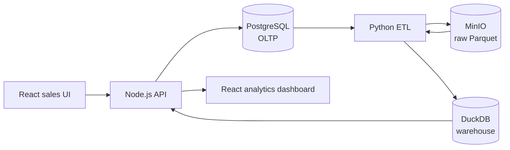

# Full-Stack Data Lake & Data Warehouse — Implementation Plan

## 1. Purpose and scope

Build a sales-management application that also demonstrates a complete analytical data platform. The operational application records customers, products, and sales orders; a reproducible pipeline copies an immutable raw snapshot to a data lake, transforms it into a star-schema warehouse, and powers a dashboard from the warehouse.

This document is deliberately written before application code. It is the implementation contract, the build order, and the checklist for the evaluator.

### Repository

- GitHub repository: <https://github.com/YOGESHTALLURI/sales-lakehouse-analytics>
- Default branch: `main`
- Current local state: Phases 0-2 are merged into `main`. Phase 3 is complete on `feat/lake-and-warehouse-pipeline`. Phase 5 (frontend) is being built in parallel on `feat/frontend` against the OpenAPI contract - see docs/frontend-brief.md.
- Phase 0 committed planning material only. Phase 1 added the folder structure, the Compose skeleton, the environment contract, the API and architecture contracts, and the health endpoint. Phase 2 adds continuous integration, the OLTP schema, the synthetic-data generator and the operational APIs.

### Non-negotiable engineering goals

- Every substantive change is committed to Git in small, meaningful units.
- All example business data is generated by this project, not downloaded from an external source.
- A fresh clone can be started locally with Docker Compose and documented commands.
- Analytics endpoints query the warehouse, never the operational PostgreSQL database.
- Raw lake objects are append-only and never edited in place.

## 2. Requirement interpretation

The assignment asks for a usable full-stack sales application and an end-to-end pipeline that clearly separates three data responsibilities:

| Layer | Purpose | Required implementation |
|---|---|---|
| Operational / OLTP | Record day-to-day sales activity reliably | PostgreSQL tables and transaction APIs |
| Data Lake | Preserve raw, immutable extracts | MinIO object storage with date/run-partitioned Parquet |
| Data Warehouse | Serve analytical queries efficiently | DuckDB star schema |

The required business flow is:



## 3. Architecture decisions and rationale

### Technology stack

| Concern | Choice | Why it fits this project |
|---|---|---|
| Frontend | React + TypeScript + Vite | The application has forms, tables, state changes and a dashboard. React is appropriate for this interactive UI; TypeScript keeps API and chart data contracts explicit; Vite keeps the build simple. |
| API | Node.js + TypeScript + Express | A small REST service is sufficient. Express gives a transparent, lightweight API layer and is directly aligned with the assignment’s recommended stack. Keeping the UI and API in TypeScript reduces contract drift. |
| Validation | Zod | Every create endpoint needs trustworthy runtime validation, not only TypeScript compile-time types. |
| OLTP | PostgreSQL | Orders, customers and products are related transactional records that need foreign keys, constraints and atomic writes. PostgreSQL is optimized for that workload. |
| Data Lake | MinIO | It provides S3-compatible object storage locally in Docker, so raw data can be stored as proper lake objects without depending on a paid cloud account. |
| Lake format | Parquet | Columnar, typed, compressed, portable, and directly suited to analytical processing. Raw files are cheaper and faster to scan than JSON/CSV at analytical scale. |
| Pipeline | Python + Polars + PyArrow + SQLAlchemy | Python has a mature, focused ecosystem for extracting relational data, writing Parquet and performing repeatable data transformations. Polars/PyArrow are efficient and explicit for tabular ETL. |
| Warehouse | DuckDB | An embedded analytical SQL engine is ideal for the assignment’s single-node analytical workload. It queries columnar data efficiently and avoids operating a separate warehouse server. It remains logically separate from PostgreSQL. |
| Charts | Recharts | It provides React-native charts for the required daily revenue and category/top-product views without adding a hosted reporting tool. |
| Packaging | Docker Compose | The system has multiple services with dependencies and shared configuration. Compose starts the entire local demo consistently with one command. |
| Tests | Vitest + Supertest; pytest | Each language uses fast, idiomatic tools. API contracts, transformations and the full pipeline can be verified separately and together. |
| Automation | GitHub Actions | It validates the repository on every push/pull request, giving visible evidence of repeatability without making cloud deployment a dependency. |

### Deliberate exclusions

- No cloud data warehouse or managed data lake is needed for the core assignment; those would add cost and operational complexity without improving the demonstration.
- No microservices or message broker: one API and one batch ETL service keep the boundaries clear while avoiding distributed-system overhead.
- No direct dashboard reads from PostgreSQL: that would erase the required OLTP/warehouse separation.

## 4. Data model

### Operational schema (PostgreSQL)

Use normalized tables with migrations and constraints:

- `customers`: UUID primary key, name, email (unique), city, state, created_at.
- `products`: UUID primary key, SKU (unique), name, category, unit_price, active, created_at.
- `orders`: UUID primary key, customer_id FK, order_date, status, created_at.
- `order_items`: UUID primary key, order_id FK, product_id FK, quantity (> 0), unit_price_at_sale (>= 0).
- `pipeline_runs`: UUID primary key, status, started_at, completed_at, row counts, lake prefix, error summary.

`order_items` is included even if the brief describes an `orders` table only: an order can contain several products, and preserving the price-at-sale prevents history from changing when a product price later changes. The warehouse’s `fact_sales` remains one row per sold order item.

### Warehouse schema (DuckDB)

The minimum assignment star schema is retained and extended with a date dimension for robust time-series queries:

- `dim_customer(customer_key, customer_id, name, city, state, created_at)`
- `dim_product(product_key, product_id, sku, name, category, current_unit_price)`
- `dim_date(date_key, full_date, day, month, month_name, quarter, year)`
- `fact_sales(sale_key, order_id, order_item_id, customer_key, product_key, date_key, quantity, unit_price, revenue)`

Keys are rebuilt deterministically for the assignment’s full-refresh pipeline. The ETL must assert that every fact has matching dimensions and that `revenue = quantity × unit_price`.

## 5. Data lake and ETL design

### Lake layout

One generated run receives an immutable run identifier and date. New runs create new prefixes rather than overwriting prior extracts.

```text
sales-lake/
  raw/
    run_date=YYYY-MM-DD/
      run_id=<uuid>/
        customers.parquet
        products.parquet
        orders.parquet
        order_items.parquet
        manifest.json
```

`manifest.json` records source row counts, schema version, extraction timestamp, checksums and the generator/pipeline version. It makes a run auditable and demonstrates that the lake is not a temporary file dump.

### Pipeline contract

`python -m etl.run_pipeline` performs one full, observable run:

1. Create a `pipeline_runs` record with `running` status.
2. Extract consistent PostgreSQL snapshots of source tables.
3. Validate source schemas and business rules.
4. Write Parquet locally, checksum it, and upload it once to the run-specific MinIO prefix.
5. Upload the manifest; do not modify raw objects after this point.
6. Read the Parquet run from MinIO, transform to dimensions and facts, and run quality checks.
7. Build a temporary DuckDB warehouse file; atomically replace the published warehouse file only after all checks pass.
8. Record success/failure, timestamps and counts in PostgreSQL. Preserve a concise sanitized error summary on failure.

The API may start the pipeline via `POST /api/pipeline/run`; only one run is permitted at a time. `GET /api/pipeline/status` reads the persisted run status. The UI polls it while a run is active.

## 6. API contract

The final OpenAPI file is the source of truth. Initial endpoints are:

| Area | Endpoint | Behavior |
|---|---|---|
| Customers | `POST /api/customers`, `GET /api/customers` | Validate and create/list customers in PostgreSQL. |
| Products | `POST /api/products`, `GET /api/products` | Validate and create/list products in PostgreSQL. |
| Orders | `POST /api/orders`, `GET /api/orders` | Create an order with items atomically; list order history. |
| Pipeline | `POST /api/pipeline/run`, `GET /api/pipeline/status` | Start one ETL run and expose current/latest status, row counts and last successful run. |
| Analytics | `GET /api/analytics/revenue` | Return total revenue, orders, customers and average order value from DuckDB. |
| Analytics | `GET /api/analytics/sales-by-product` | Return product/category aggregates and top products from DuckDB. |
| Analytics | `GET /api/analytics/sales-by-city` | Return city aggregates from DuckDB. |
| Analytics | `GET /api/analytics/daily-sales` | Return time-series revenue and order count from DuckDB. |
| Health | `GET /health` | Dependency-aware readiness summary appropriate for local containers. |

## 7. Repository structure

```text
sales-lakehouse-analytics/
  README.md
  IMPLEMENTATION_PLAN.md
  ARCHITECTURE.md
  CONTRIBUTING.md
  .gitignore
  .env.example
  compose.yaml
  docs/
    api/openapi.yaml
    diagrams/
    decisions/
    demo-script.md
  apps/
    web/                         # React + TypeScript
    api/                         # Express + TypeScript
  data/
    postgres/
      migrations/
      seeds/
    warehouse/                   # ignored generated DuckDB file; README only committed
  etl/
    src/etl/
      extract.py
      lake.py
      transform.py
      warehouse.py
      quality.py
      run_pipeline.py
    tests/
    pyproject.toml
  scripts/
    generate_synthetic_data.py
    wait-for-services.*
  infra/
    minio/
      create-bucket.sh
  tests/
    e2e/
  .github/workflows/ci.yml
```

Generated data, Docker volumes, local `.env` files, MinIO objects, coverage output and `.duckdb` files are ignored. Code, migrations, seed generator, schemas, manifests used only as documentation examples, and test fixtures are committed.

## 8. Synthetic-data strategy

The candidate owns every dataset. The generator must be deterministic: a documented seed plus requested counts produces the same valid dataset on any machine.

- Use Faker only as a name/address vocabulary source; do not fetch data from network services.
- Generate 500 customers across a controlled list of Indian cities/states, 100 products across realistic categories, and 10,000+ orders across a 12-month period.
- Generate 1–5 order items per order, weighted category demand, seasonality, repeat customers and price ranges. This produces charts with meaningful variation rather than random noise.
- Enforce referential integrity and domain constraints before inserting.
- Commit the generator, seed configuration, fixed random seed and validation report—not the large generated runtime dataset.
- Provide `make seed` / documented Compose command that clears only development seed tables through migrations and regenerates predictable data. Never make the production-style pipeline depend on hand-created records.

## 9. Implementation phases (and required order)

### Phase 0 — Establish the repository and plan

1. Create the Git repository locally; create the GitHub remote only after explicit user approval for the remote action.
2. Add this plan, `.gitignore`, `.editorconfig`, license choice, `.env.example`, README skeleton and contribution rules.
3. Commit: `chore: initialize repository and implementation plan`.

**Exit criteria:** clean repository, no secrets, documented setup assumptions, and this plan is committed.

### Phase 1 — Foundation and contracts

1. Create the folder structure, Compose skeleton and environment variable contract.
2. Define PostgreSQL migrations and the OpenAPI contract before UI implementation.
3. Add a minimal health endpoint and service readiness checks.
4. Commit: `chore: add local development foundation` and `docs: define API and data contracts`.

**Exit criteria:** `docker compose up` starts PostgreSQL and MinIO; migrations run from a clean volume.

### Phase 2 — Operational application

1. Implement migrations and deterministic synthetic-data generator.
2. Implement customer, product and order APIs, validation, transactions and error responses.
3. Add API tests against an isolated test database.
4. Commit by coherent feature: schema, generator, customers/products, then orders.

**Exit criteria:** the API can create/list every core entity; orders cannot violate stock-independent business constraints; tests pass.

### Phase 3 — Lake and warehouse pipeline

1. Implement extraction and immutable, partitioned Parquet uploads to MinIO.
2. Add manifests, checksums and raw data validation.
3. Implement DuckDB dimensions/facts, data-quality checks, atomic publish and run audit status.
4. Add ETL unit tests and an end-to-end pipeline test.
5. Commit separately for extraction/lake and transformation/warehouse.

**Exit criteria:** one command turns seeded PostgreSQL data into a verifiable MinIO run and populated DuckDB star schema.

### Phase 4 — Analytics and pipeline control

1. Implement DuckDB-backed analytics queries and pipeline start/status APIs.
2. Prove at test level that analytics code cannot fall back to PostgreSQL.
3. Commit: `feat: add warehouse analytics and pipeline status APIs`.

**Exit criteria:** returned totals match independently calculated warehouse values, including empty-warehouse behavior.

### Phase 5 — Frontend

1. Build sales-management pages: customers, products, order creation and order list.
2. Build the analytics dashboard: KPI cards, daily revenue chart, sales-by-category/top-products chart, city results, clear loading/empty/error states.
3. Build pipeline-control panel with run button, live status, record counts and last-success time.
4. Commit by feature area.

**Exit criteria:** a user can record a sale, run the pipeline, and see warehouse analytics refresh from the dashboard.

### Phase 6 — Quality, packaging and handoff

1. Finish Compose images, health checks, named volumes and first-run instructions.
2. Extend CI with the end-to-end pipeline test and any remaining lint steps. CI itself was brought forward to Phase 2 — a workflow added in the final phase validates none of the phases it was not watching.
3. Finalize README, architecture diagram, decision records, deployment guide and demo script.
4. Test from a clean clone/volumes and record the result.

**Exit criteria:** the evaluator can follow README instructions and complete the demo without undocumented manual work.

## 10. Testing strategy

| Level | What is verified |
|---|---|
| Static checks | TypeScript typechecking, formatting, linting, Python lint/type checks where configured. |
| API unit/integration | Validation, error handling, foreign keys, transactional order creation, documented responses. |
| ETL unit | Type conversion, revenue calculation, date dimensions, duplicate handling, manifest creation. |
| Data quality | Non-null keys, dimension joins, unique business IDs, fact/dimension counts, `revenue = quantity × unit_price`. |
| Warehouse query | KPI and aggregate results use DuckDB and match known fixture values. |
| End-to-end | Seed → PostgreSQL → MinIO Parquet → DuckDB → analytics API → dashboard-ready responses. |
| Smoke/demo | Fresh Compose startup, one manually created sale, one pipeline run and dashboard refresh. |

CI runs on every push to every branch, from Phase 2 onward, in two jobs:

- **static-checks** — typecheck, unit tests, `npm audit`, the OpenAPI contract lint and `docker compose config`. Needs no services, so it fails fast.
- **integration** — PostgreSQL as a service container, the documented `npm run migrate` command applied to a clean database and then re-applied to prove it is a no-op, followed by the database integration suite.

Unit specs must never require a running service; anything that does belongs in `tests/integration/` and provisions its own throwaway database. The full end-to-end pipeline test arrives with Phase 3 and may use Compose, because it needs every local service.

## 11. Docker Compose and local development

Compose services:

- `web`: React development/production build served on the documented web port.
- `api`: Express service, mounted to its source only in the development override.
- `postgres`: PostgreSQL with persistent named development volume and migration bootstrap.
- `minio`: object storage with named volume and a one-shot bucket-initialization service.
- `etl`: Python image used for pipeline runs; it shares only a warehouse volume with the API, never a PostgreSQL data directory.

DuckDB is a file on the named `warehouse-data` volume, not an unnecessary always-running server. API access is read-only and ETL obtains an exclusive lock while publishing. The pipeline endpoint delegates a job to the ETL container rather than embedding Python inside Node.

Required documentation commands (final names decided during Phase 1):

```text
docker compose up --build
docker compose exec api npm run migrate
docker compose exec api npm run seed
docker compose run --rm etl python -m etl.run_pipeline
```

## 12. Deployment options

Local Docker Compose is the baseline and should be the primary submission because the assignment treats cloud deployment as optional.

For a complete cloud demo, prefer a single small virtual machine running the same Compose stack behind HTTPS (for example, a general-purpose VM provider). It deploys the same services—PostgreSQL, MinIO, API, web, and ETL—without architectural substitution. Persistent block storage and off-site backups are required because both PostgreSQL and MinIO contain state.

An optional production-oriented evolution, only after the local deliverable is complete:

- Static frontend on an object/CDN host.
- API and scheduled ETL on containers.
- Managed PostgreSQL and S3-compatible object storage.
- DuckDB retained on a shared persistent volume only for a single API replica, or replaced with a managed analytical warehouse if multi-replica concurrency is required.

The first cloud option is best for this assignment because it demonstrates the exact architecture with the fewest moving parts. Avoid claiming any provider is permanently free; verify current pricing before enabling a paid deployment.

## 13. Git and GitHub strategy

### Repository rules

- Do not implement directly on `main`. `main` is the stable, integrated history only.
- Create one branch per phase from the latest `main`; commit each verified slice as it is completed, then merge the branch to `main` once the phase's checks pass.
- Keep a branch focused on one boundary. Do not mix frontend, backend and ETL changes without a genuine integration reason.
- One logical change per commit, in imperative Conventional Commit style.
- Commit tests with the feature they protect; never backfill all tests in one final commit.
- Do not commit credentials, `.env`, database volumes, generated Parquet runs, MinIO files, coverage, build output or the DuckDB database.
- Use GitHub issues/milestones only after the remote exists; link PRs to phases when collaboration is involved.

### Branch map

One branch per phase, created in this dependency-aware order and merged to `main` before the next begins. Each phase is a single architectural boundary, which is the unit worth reviewing; splitting one boundary across several branches adds merge ceremony without adding review value.

Granularity is carried by **commits inside** the branch, not by branch count — the planned commit history below is unchanged, and each commit still lands only after its own verification passes.

| Branch | Phase | Scope | Merge evidence |
|---|---|---|---|
| `chore/project-foundation` | 1 | Repository folders, Compose skeleton, environment contract, API/data contracts, health endpoint | Merged. Compose validates; OpenAPI lints; health endpoint verified live. |
| `feat/operational-application` | 2 | GitHub Actions CI, PostgreSQL migrations, deterministic synthetic-data generator, customer/product/order APIs | Fresh migration succeeds; seed is repeatable; API integration tests pass. |
| `feat/lake-and-warehouse-pipeline` | 3 | PostgreSQL extract, immutable run-partitioned Parquet and manifests in MinIO, DuckDB dimensions/facts, quality checks, atomic publish | Object/manifest validation; warehouse query and end-to-end pipeline tests. |
| `feat/analytics-api` | 4 | DuckDB-backed analytics endpoints and pipeline run/status control | API/warehouse contract tests; analytics proven unable to reach PostgreSQL. |
| `feat/frontend` | 5 | Sales-management pages, analytics dashboard, pipeline-control panel | UI build, API smoke tests and the end-to-end demo. |
| `chore/quality-and-delivery` | 6 | Docker hardening, CI extension for the end-to-end pipeline test, documentation, decision records and deployment guide | Clean-clone Compose smoke test. |

Within a branch, stop and commit at each coherent slice rather than at the end. Phase 2, for example, lands as schema → generator → customers/products → orders, each with its own tests.

If a branch needs a targeted corrective change after it is merged, use a narrowly named follow-up branch (for example `fix/order-validation`) rather than committing directly to `main`.

### Planned meaningful commit history

```text
chore: initialize repository and implementation plan
chore: add Docker Compose development foundation
docs: define API and data contracts
feat: add PostgreSQL schema migrations
feat: add deterministic synthetic sales generator
feat: add customer and product APIs
feat: add transactional order APIs
feat: export immutable raw parquet runs to MinIO
feat: build DuckDB sales warehouse
test: cover end-to-end data pipeline
feat: add warehouse-backed analytics APIs
feat: add sales management interface
feat: add analytics dashboard and pipeline controls
chore: finalize containerized application
docs: add architecture, deployment and demo guide
```

Commit only after a narrow verification step passes. The history must reflect actual development order—never fabricate timestamps or squash the story into one generated commit.

### Working cadence: build, verify, commit, push

Work as an engineer would on a small, reviewable feature—not as a one-shot code generation exercise:

1. Select the next smallest unchecked item from the current phase.
2. Implement only that coherent item and its directly related tests/docs.
3. Run the relevant verification (for example type checks, unit tests, or the pipeline smoke test).
4. Inspect `git diff` and `git status`; do not include generated data, secrets, or unrelated files.
5. Create one descriptive commit using the planned Conventional Commit style.
6. Push that verified commit to its feature branch on `origin`. Do not wait until the whole project is complete.
7. When the phase is complete, merge its branch into `main` locally and push, recording the commit hash and the acceptance criteria met. Merge only after the phase's checks pass.

Suggested cadence is one push per completed vertical slice, normally 30–90 minutes of focused work. Examples: schema + migration test, synthetic generator + validation test, customer/product API + API tests, MinIO extraction + manifest validation. Do not create artificial micro-commits for individual files and do not group unrelated features together.

Before each push, confirm these commands succeed where applicable:

```text
git status
npm run lint && npm run test
python -m pytest
docker compose config
```

The first push publishes the plan commit to `main`. Every subsequent push goes to the current phase's branch, which is merged into `main` when the phase completes. This preserves a credible, chronological engineering history and shows how each system boundary was integrated.

## 14. Documentation deliverables

- `README.md`: problem statement, architecture summary, prerequisites, quick start, environment variables, commands, tests, troubleshooting and demo flow.
- `ARCHITECTURE.md`: component boundaries, data movement, schemas, lake immutability policy, warehouse design and trade-offs.
- `docs/api/openapi.yaml`: request/response contract.
- `docs/decisions/`: short architecture decision records for Node/Express, MinIO, DuckDB and full-refresh loading.
- `docs/demo-script.md`: an evaluator-ready script that creates/uses data, runs the pipeline, inspects MinIO and verifies dashboard outputs.
- `.env.example`: fake defaults/placeholders only, never credentials.

## 15. Acceptance criteria and traceability

| Assignment/evaluator requirement | Planned evidence of completion |
|---|---|
| React + TypeScript frontend | `apps/web`, working sales pages and dashboard; frontend checks/tests. |
| Sales management application | Customer, product and multi-item order creation plus order list backed by PostgreSQL. |
| PostgreSQL for operational data | Versioned migrations, constraints, seed command and API integration tests. |
| Data Lake (MinIO/S3-compatible) | Running MinIO service, `sales-lake` bucket, immutable run-partitioned raw Parquet and manifest. |
| Raw data preserved / immutable | Unique run prefixes, no overwrite policy, checksums and manifest timestamps. |
| Data Warehouse (DuckDB or PostgreSQL) | DuckDB file with `dim_customer`, `dim_product`, `fact_sales` and optional `dim_date`. |
| Star schema | Architecture documentation, DuckDB DDL and quality tests for facts/dimensions. |
| ETL/ELT from OLTP through lake into warehouse | One executable pipeline, audited run status, MinIO objects and warehouse counts. |
| Analytics APIs | Four documented endpoints for revenue, product/category sales, city sales and daily sales. |
| Analytics read the warehouse | API module opens DuckDB; integration test verifies warehouse fixture results. |
| Analytics dashboard | KPI cards plus required time-series and category/top-product visualizations. |
| Run Data Pipeline UI/action | Button, status state, row counts and last successful timestamp using pipeline APIs. |
| Docker Compose setup | `compose.yaml`, Dockerfiles, health checks, documented clean-start command. |
| README and architecture diagram | Root README, `ARCHITECTURE.md`, Mermaid/source diagram and demo script. |
| Optional deployment consideration | This section and final deployment guide describe a reproducible VM-based option. |
| Everything in Git | Initial and follow-on commits, `.gitignore`, no untracked deliverable changes at handoff. |
| Meaningful commit history | The planned sequence is followed as verified features are completed. |
| Candidate-created synthetic data | Deterministic generator, documented seed/configuration and validation report. |
| Technology choices justified by requirements | Section 3 decisions and decision records explain workload-based trade-offs. |

## 16. Immediate next action

Phases 0 and 1 are complete and merged into `main`:

- Repository, plan and project instructions committed.
- `chore/project-foundation` delivered the folder structure, the Compose skeleton
  for PostgreSQL and MinIO, the environment contract, the OpenAPI and
  architecture contracts, and a dependency-aware `GET /health` endpoint.

One item from Phase 1's exit criteria is deliberately outstanding: *migrations
run from a clean volume*. No schema exists yet, because migrations belong to the
operational-application boundary. Phase 2 satisfies it.

Phase 2 is complete on `feat/operational-application`, delivered in this order:

1. `ci: run typecheck, tests and migrations on every push` — CI brought forward
   from Phase 6, so every later phase is validated as it lands.
2. `feat: add PostgreSQL schema migrations` — the five OLTP tables with their
   constraints, a migration runner, and a fresh-database migration suite. This
   also satisfied Phase 1's outstanding *migrations run from a clean volume*.
3. `feat: add deterministic synthetic sales generator` — fixed-seed generator for
   500 customers, 100 products and 10,000 orders over 12 months, with a
   validation report and a checksum test locking reproducibility.
4. `feat: add operational customer, product and order APIs` — Zod validation,
   database-arbitrated conflicts, and multi-item orders written in one
   transaction capturing price-at-sale.

Phase 2's exit criteria are met: every core entity can be created and listed,
orders cannot violate the documented business constraints, and the tests pass.

Merge the branch into `main`, then begin Phase 3 on
`feat/lake-and-warehouse-pipeline`. Phase 3 introduces the Python ETL and the
`etl` Compose service, extracts a consistent PostgreSQL snapshot into immutable
run-partitioned Parquet in MinIO with a manifest, then rebuilds the DuckDB star
schema *from the lake* and publishes it atomically.
