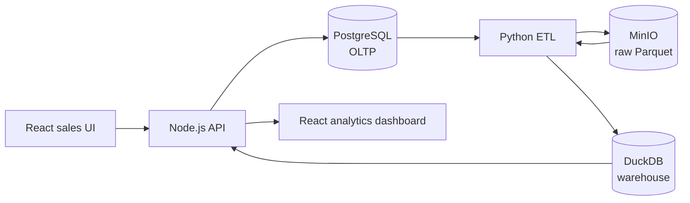

# Sales Lakehouse Analytics

A sales-management application that doubles as a complete, reproducible
analytical data platform. Operational sales activity is recorded in
PostgreSQL, copied to an immutable raw data lake in MinIO, transformed into a
DuckDB star schema, and served back to a React dashboard through
warehouse-only analytics APIs.

The full engineering contract — architecture decisions, data model, ETL
design, phase order and branch map — is in
[IMPLEMENTATION_PLAN.md](IMPLEMENTATION_PLAN.md).

## Architecture



Three data responsibilities stay strictly separated:

| Layer | Store | Responsibility |
|---|---|---|
| Operational (OLTP) | PostgreSQL | Transactional customer, product and order records |
| Data lake | MinIO | Append-only, run-partitioned raw Parquet extracts |
| Data warehouse | DuckDB | Star schema serving every analytics query |

Two rules follow from that split and are enforced in code and tests:
analytics endpoints never read PostgreSQL, and raw lake objects are never
edited in place.

## Build status

Phases are delivered in the order defined by the plan; each lands on its own
feature branch and merges to `main` only after its checks pass.

| Phase | Scope | State |
|---|---|---|
| 0 | Repository and implementation plan | Complete |
| 1 | Foundation: folders, Compose skeleton, environment and API contracts, health endpoint | Complete |
| 2 | Operational application: migrations, synthetic data, customer/product/order APIs | In progress |
| 3 | Lake and warehouse pipeline | Not started |
| 4 | Analytics and pipeline-control APIs | Not started |
| 5 | Frontend: sales pages and analytics dashboard | Not started |
| 6 | Quality, packaging and handoff | Not started |

Commands below are marked with the phase that makes them work. Anything marked
as a later phase is not yet runnable from this commit.

## Continuous integration

[GitHub Actions](.github/workflows/ci.yml) runs on every push to every branch, in
two jobs:

- **static-checks** — typecheck, unit tests, `npm audit`, OpenAPI contract lint
  and `docker compose config`. No services required, so it fails fast.
- **integration** — PostgreSQL as a service container; applies `npm run migrate`
  to a clean database, re-applies it to prove the second run is a no-op, then
  runs the database integration suite.

Every step is a command you can run locally, listed under [Commands](#commands).

## Prerequisites

- Docker Engine with Compose v2 (`docker compose version`)
- Node.js 20+ and npm — only needed to work on `apps/api` or `apps/web`
  outside containers
- Python 3.11+ — only needed to work on `etl/` outside containers; the
  pipeline itself runs in the `etl` container

Verified against Docker 29.6, Compose v5.3, Node 24 and PostgreSQL 16.

## Quick start

```bash
git clone https://github.com/YOGESHTALLURI/sales-lakehouse-analytics.git
cd sales-lakehouse-analytics
cp .env.example .env          # local placeholders only; never commit .env
docker compose up -d --build  # starts PostgreSQL, MinIO, the bucket init job and the API
sh scripts/wait-for-services.sh   # blocks until each service can actually serve
```

Expected result: `postgres`, `minio` and `api` report `healthy`, and
`minio-init` exits `0` after creating the `sales-lake` bucket. On Windows use
`./scripts/wait-for-services.ps1` instead.

| Service | URL | Notes |
|---|---|---|
| API | <http://localhost:4000/health> | Dependency-aware readiness |
| PostgreSQL | `localhost:55432` | Credentials from `.env` |
| MinIO S3 API | <http://localhost:9000> | Used by the ETL |
| MinIO console | <http://localhost:9001> | Sign in with `MINIO_ROOT_USER` / `MINIO_ROOT_PASSWORD` |

`/health` returns `200` with `"status": "ok"` once PostgreSQL is reachable. The
warehouse reports `down` with `"warehouse not published yet"` until the first
pipeline run — that is expected on a fresh stack, not a fault, so it does not
fail readiness. If PostgreSQL goes away the API stays up and returns `503`
`"degraded"`, then recovers on its own when PostgreSQL returns.

Shut down, keeping data:

```bash
docker compose down
```

Shut down and discard all local state (a genuine clean-slate test):

```bash
docker compose down -v
```

## Commands

```bash
# Phase 1 — infrastructure, contracts and health
docker compose config                 # validate the Compose contract
docker compose up -d --build          # start PostgreSQL, MinIO and the API
docker compose logs -f minio-init     # confirm the lake bucket was created
sh scripts/wait-for-services.sh       # wait until services can serve traffic
curl -s http://localhost:4000/health  # dependency-aware readiness
npx @redocly/cli@1 lint docs/api/openapi.yaml   # validate the API contract
npm run typecheck                     # TypeScript across the workspace
npm test                              # Vitest across the workspace

# Phase 2 — operational application
docker compose exec api npm run migrate   # apply OLTP schema migrations
docker compose exec api npm run seed      # not yet available

# Phase 3 — pipeline (not yet available)
docker compose run --rm etl python -m etl.run_pipeline
```

## Configuration

`.env.example` is the environment contract and documents every variable with
the boundary it belongs to: PostgreSQL, MinIO, DuckDB, API, web and the
synthetic-data generator. Copy it to `.env` and edit locally.

`.env` is git-ignored. The committed example contains local placeholders only —
no credential in this repository is real, and none should ever be.

## Repository layout

```text
apps/api/                 Express + TypeScript API (OLTP + analytics endpoints)
apps/web/                 React + TypeScript + Vite frontend
data/postgres/migrations  Versioned OLTP schema migrations
data/postgres/seeds       Seed configuration for the synthetic generator
data/warehouse/           Generated DuckDB file (ignored; README committed)
docs/api/openapi.yaml     API contract, source of truth for requests/responses
docs/decisions/           Architecture decision records
etl/src/etl/              Extract, lake, transform, warehouse, quality, runner
infra/minio/              Lake bucket provisioning
scripts/                  Synthetic data generator and service readiness helpers
tests/e2e/                End-to-end pipeline and dashboard checks
```

## Tests

Each language keeps its own idiomatic tooling; see
[IMPLEMENTATION_PLAN.md §10](IMPLEMENTATION_PLAN.md) for the full strategy.

```bash
npm install                                    # once, from the repository root
npm run typecheck                              # TypeScript, all workspaces
npm test                                       # Vitest, all workspaces
npm test --workspace @sales-lakehouse/api      # API only (Vitest + Supertest)
npm run test:integration --workspace @sales-lakehouse/api   # needs docker compose up -d postgres
docker compose run --rm etl python -m pytest   # pytest (from Phase 3)
```

The API suite needs no running services: dependency probes are injected, so
every `/health` outcome — ready, warehouse-missing, database-down — is covered
without Docker.

## Troubleshooting

| Symptom | Cause and fix |
|---|---|
| `set POSTGRES_PASSWORD in .env` on `docker compose up` | `.env` is missing. Run `cp .env.example .env`. |
| Port 5432 / 9000 / 9001 already allocated | Another service owns the port. Change `POSTGRES_HOST_PORT`, `MINIO_API_HOST_PORT` or `MINIO_CONSOLE_HOST_PORT` in `.env`. |
| `minio-init` exits non-zero | MinIO was not healthy yet, or the root credentials in `.env` disagree with the existing `minio-data` volume. Check `docker compose logs minio-init`. |
| PostgreSQL rejects the password after changing `.env` | Credentials are baked in at volume initialisation. `docker compose down -v` then `up -d` to reinitialise. |
| `docker compose up -d --wait` exits `1` although every service is healthy | `--wait` treats the one-shot `minio-init` container as a failure when it exits. Use plain `docker compose up -d` and `sh scripts/wait-for-services.sh`. |
| `/health` returns `503` with `"warehouse": "down"` only | Not an error. PostgreSQL is down — check `docker compose ps postgres`. A `down` warehouse alone still returns `200`. |
| API cannot reach PostgreSQL from the host | The API talks to `postgres:5432` on the Compose network, not `localhost:55432`. Only change `POSTGRES_HOST` when running the API outside Docker. |

## Documentation

- [IMPLEMENTATION_PLAN.md](IMPLEMENTATION_PLAN.md) — implementation contract and build order
- [ARCHITECTURE.md](ARCHITECTURE.md) — component boundaries, schemas, lake immutability policy and trade-offs
- [docs/api/openapi.yaml](docs/api/openapi.yaml) — request/response contract, the source of truth for the API
- [CONTRIBUTING.md](CONTRIBUTING.md) — branch, commit and verification rules
- [CLAUDE.md](CLAUDE.md) — project instructions applied while building

## License

[MIT](LICENSE)
