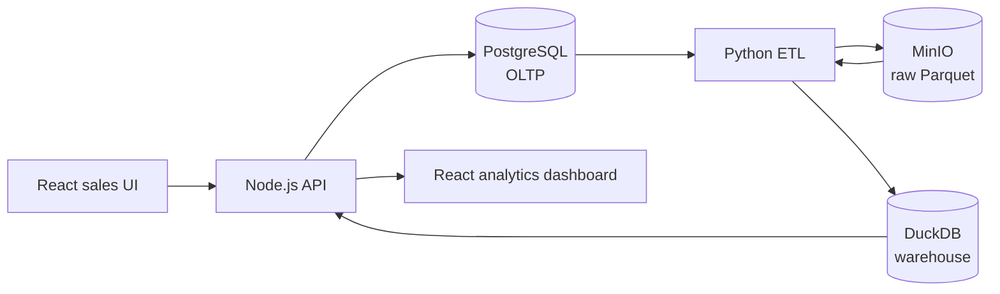

# Sales Lakehouse Analytics

A sales-management application that doubles as a complete, reproducible
analytical data platform. Operational sales activity is recorded in
PostgreSQL, copied to an immutable raw data lake in MinIO, transformed into a
DuckDB star schema, and served back to a React dashboard through
warehouse-only analytics APIs.

## Architecture



Three data responsibilities stay strictly separated:

| Layer | Store | Responsibility |
|---|---|---|
| Operational (OLTP) | PostgreSQL | Transactional customer, product and order records |
| Data lake | MinIO | Append-only, run-partitioned raw Parquet extracts |
| Data warehouse | DuckDB | Star schema serving every analytics query |

Two rules follow from that split and are enforced in code and tests:
analytics endpoints never read PostgreSQL, and raw lake objects are never
edited in place.

## Features

- **Sales management** — create and browse customers, products and
  multi-item orders, all recorded transactionally in PostgreSQL
- **Deterministic synthetic data** — 500 customers, 100 products and 10,000+
  orders, generated by this repository with a fixed seed; no external dataset
  is downloaded
- **Immutable data lake** — every pipeline run writes a checksummed,
  run-partitioned Parquet extract to MinIO that is never overwritten
- **DuckDB warehouse** — a star schema (`dim_customer`, `dim_product`,
  `dim_date`, `fact_sales`) rebuilt from the lake and published atomically
  behind 14 automated data-quality checks
- **Analytics dashboard** — KPI cards, a daily revenue trend, category and
  top-product breakdowns and a city breakdown, all served from the warehouse
- **Pipeline control** — start a run from the UI and watch it move through
  queued → running → succeeded/failed, with row counts and lake location

## API endpoints

Every request the React frontend makes to the Express API, in one place — the
UI has no other server it talks to.

| Method | Endpoint | Used for |
|---|---|---|
| `GET` | `/health` | Startup readiness check |
| `GET` | `/api/customers` | List customers (paginated) |
| `POST` | `/api/customers` | Create a customer |
| `GET` | `/api/products` | List products (paginated, filterable) |
| `POST` | `/api/products` | Create a product |
| `GET` | `/api/orders` | List orders (paginated, filterable) |
| `POST` | `/api/orders` | Create a multi-item order |
| `POST` | `/api/pipeline/run` | Start a pipeline run |
| `GET` | `/api/pipeline/status` | Poll the current and last-successful run |
| `GET` | `/api/analytics/revenue` | KPI cards on the dashboard |
| `GET` | `/api/analytics/sales-by-product` | Category and top-product charts |
| `GET` | `/api/analytics/sales-by-city` | City breakdown |
| `GET` | `/api/analytics/daily-sales` | Daily revenue trend chart |

The full request/response shapes, validation rules and error codes are in
[docs/api/openapi.yaml](docs/api/openapi.yaml). In development the frontend
calls these as relative paths and Vite proxies them to the API; in the Docker
build, nginx does the same — so the browser never talks cross-origin and no
backend URL is compiled into the bundle.

## Stack

| Layer | Choice |
|---|---|
| Frontend | React 19, TypeScript, Vite, Tailwind CSS, Recharts |
| API | Node.js, TypeScript, Express, Zod |
| Operational database | PostgreSQL 16 |
| Data lake | MinIO (S3-compatible) |
| ETL | Python, PyArrow, DuckDB, SQLAlchemy |
| Warehouse | DuckDB |
| Packaging | Docker Compose |
| Tests | Vitest + Testing Library + Supertest, pytest |
| CI | GitHub Actions |

## Prerequisites

- Docker Engine with Compose v2 (`docker compose version`)
- Node.js 20+ and npm — only needed to work on `apps/api` or `apps/web`
  outside containers
- Python 3.11+ — only needed to work on `etl/` outside containers; the
  pipeline itself runs in the `etl` container

Verified against Docker 29.6, Compose v5.3, Node 24 and PostgreSQL 16.

## Quick start

```bash
git clone https://github.com/YOGESHTALLURI/sales-lakehouse-analytics.git
cd sales-lakehouse-analytics
cp .env.example .env          # local placeholders only; never commit .env
docker compose up -d --build  # starts every service: db, lake, api, web, etl worker
sh scripts/wait-for-services.sh   # blocks until each service can actually serve
```

Then, once, seed the operational database and build the first warehouse:

```bash
docker compose exec api npm run migrate
docker compose exec api npm run seed
docker compose run --rm etl python -m etl.run_pipeline
```

Open the app:

| Service | URL | Notes |
|---|---|---|
| Web UI | <http://localhost:5173> | Sales management and the analytics dashboard |
| API | <http://localhost:4000/health> | Dependency-aware readiness |
| PostgreSQL | `localhost:55432` | Credentials from `.env` |
| MinIO S3 API | <http://localhost:9000> | Used by the ETL |
| MinIO console | <http://localhost:9001> | Sign in with `MINIO_ROOT_USER` / `MINIO_ROOT_PASSWORD`; browse the raw lake runs here |

`/health` returns `200` with `"status": "ok"` once PostgreSQL is reachable. The
warehouse reports `down` with `"warehouse not published yet"` until the first
pipeline run — that is expected on a fresh stack, not a fault, so it does not
fail readiness. If PostgreSQL goes away the API stays up and returns `503`
`"degraded"`, then recovers on its own when PostgreSQL returns.

Shut down, keeping data:

```bash
docker compose down
```

Shut down and discard all local state (a genuine clean-slate test):

```bash
docker compose down -v
```

## Trying it out

1. Open <http://localhost:5173> — the dashboard shows KPIs and charts from the
   warehouse built above.
2. **Sales → New order** — pick a customer, add one or more products, submit.
   It is written straight to PostgreSQL and appears in **Sales → Orders**
   immediately.
3. **Pipeline** — click **Run pipeline**. It moves through
   `queued → running → succeeded`, extracting PostgreSQL into a new immutable
   Parquet run in MinIO and rebuilding the warehouse from it.
4. Back on the dashboard, the order from step 2 is now reflected in the
   totals — proof that the numbers come from the warehouse, not a live
   database query.

## Commands

```bash
# Infrastructure
docker compose config                 # validate the Compose contract
docker compose up -d --build          # start every service
docker compose logs -f minio-init     # confirm the lake bucket was created
sh scripts/wait-for-services.sh       # wait until services can serve traffic
curl -s http://localhost:4000/health  # dependency-aware readiness

# Operational data
docker compose exec api npm run migrate   # apply OLTP schema migrations
docker compose exec api npm run seed      # generate and load synthetic sales data
curl -s localhost:4000/api/customers?limit=2
curl -s localhost:4000/api/orders?limit=1

# Pipeline and analytics
docker compose run --rm etl python -m etl.run_pipeline   # one full pipeline run
curl -s -X POST localhost:4000/api/pipeline/run           # 202, enqueued
curl -s localhost:4000/api/pipeline/status
curl -s localhost:4000/api/analytics/revenue
curl -s 'localhost:4000/api/analytics/daily-sales?from=2026-02-01&to=2026-02-07'

# Checks
npx @redocly/cli@1 lint docs/api/openapi.yaml   # validate the API contract
npm run typecheck                     # TypeScript across the workspace
npm test                              # Vitest across the workspace
docker compose run --rm etl python -m pytest -q   # ETL unit tests
```

## Synthetic data

Every row of business data is generated by this repository — nothing is
downloaded. `npm run seed` produces 500 customers across 30 Indian cities, 100
products across 10 categories, and 10,000 orders with ~21,000 line items
spanning 12 months.

The dataset is **deterministic**: the `SEED_*` settings in `.env` plus the two
committed files in [data/postgres/seeds/](data/postgres/seeds/) fully determine
it, and the same inputs produce a byte-identical result on any machine or OS.
A test locks this to a fixed SHA-256 checksum.

It is also deliberately *shaped* rather than uniform — a festive-season peak,
busier weekends, uneven category demand, a loyal minority of repeat buyers, and
sale prices that diverge from catalogue prices. Uniform noise would make every
dashboard chart meaningless and hide whether the aggregation works.

See [apps/api/README.md](apps/api/README.md#seeding) for the full rationale.

## The pipeline

```bash
docker compose run --rm etl python -m etl.run_pipeline
```

One run extracts a consistent PostgreSQL snapshot, writes it to an immutable
run-partitioned Parquet prefix in MinIO with a checksummed manifest, reads it
**back out of the lake**, rebuilds the DuckDB star schema from those files, runs
14 data-quality checks, and publishes atomically — only if every check passes.

The API never runs the pipeline itself. `POST /api/pipeline/run` enqueues a row
in PostgreSQL; a long-running `etl-worker` service claims it and executes it.
That keeps Python out of the Node process and avoids handing the API a Docker
socket.

Afterwards `/health` reports the warehouse as `up`, and `pipeline_runs` holds the
audit record. See [etl/README.md](etl/README.md) for the design and the
verified guarantees.

## Configuration

`.env.example` is the environment contract and documents every variable with
the boundary it belongs to: PostgreSQL, MinIO, DuckDB, API, web and the
synthetic-data generator. Copy it to `.env` and edit locally.

`.env` is git-ignored. The committed example contains local placeholders only —
no credential in this repository is real, and none should ever be.

## Repository layout

```text
apps/api/                 Express + TypeScript API (OLTP + analytics + pipeline control)
apps/web/                 React + TypeScript + Vite frontend
data/postgres/migrations  Versioned OLTP schema migrations
data/postgres/seeds       Seed configuration for the synthetic generator
data/warehouse/           Generated DuckDB file (ignored; README committed)
docs/api/openapi.yaml     API contract, source of truth for requests/responses
etl/src/etl/              Extract, lake, transform, warehouse, quality, runner, worker
infra/minio/              Lake bucket provisioning
scripts/                  Synthetic data generator and service readiness helpers
```

## Tests

Each language keeps its own idiomatic tooling.

```bash
npm install                                    # once, from the repository root
npm run typecheck                              # TypeScript, all workspaces
npm test                                       # Vitest, all workspaces
npm test --workspace @sales-lakehouse/api      # API only (Vitest + Supertest)
npm test --workspace @sales-lakehouse/web      # Web only (Vitest + Testing Library)
npm run test:integration --workspace @sales-lakehouse/api   # needs docker compose up -d postgres
docker compose run --rm etl python -m pytest   # pytest
```

The API and web suites need no running services: dependency probes and
contract fixtures are injected, so every state — loading, error, empty,
warehouse-unbuilt — is covered without Docker.

## Continuous integration

[GitHub Actions](.github/workflows/ci.yml) runs on every push, in three jobs:

- **static-checks** — typecheck, unit tests, `npm audit`, OpenAPI contract lint
  and `docker compose config`. No services required, so it fails fast.
- **integration** — PostgreSQL as a service container; applies `npm run migrate`
  to a clean database and re-applies it to prove the second run is a no-op, runs
  `npm run seed` twice to prove it replaces rather than duplicates, then runs the
  database integration suite.
- **pipeline** — PostgreSQL and MinIO; runs the real ETL twice to prove the lake
  is append-only, then the end-to-end pipeline tests.

Every step is a command you can run locally, listed under [Commands](#commands).

## Troubleshooting

| Symptom | Cause and fix |
|---|---|
| `set POSTGRES_PASSWORD in .env` on `docker compose up` | `.env` is missing. Run `cp .env.example .env`. |
| Port 5173 / 4000 / 5432 / 9000 / 9001 already allocated | Another service owns the port. Change the corresponding `*_HOST_PORT` in `.env`. |
| `minio-init` exits non-zero | MinIO was not healthy yet, or the root credentials in `.env` disagree with the existing `minio-data` volume. Check `docker compose logs minio-init`. |
| PostgreSQL rejects the password after changing `.env` | Credentials are baked in at volume initialisation. `docker compose down -v` then `up -d` to reinitialise. |
| `docker compose up -d --wait` exits `1` although every service is healthy | `--wait` treats the one-shot `minio-init` container as a failure when it exits. Use plain `docker compose up -d` and `sh scripts/wait-for-services.sh`. |
| `/health` returns `503` with `"warehouse": "down"` only | Not an error. PostgreSQL is down — check `docker compose ps postgres`. A `down` warehouse alone still returns `200`. |
| Dashboard shows all zeros | No pipeline run has published a warehouse yet. Run `docker compose run --rm etl python -m etl.run_pipeline`. |
| API cannot reach PostgreSQL from the host | The API talks to `postgres:5432` on the Compose network, not `localhost:55432`. Only change `POSTGRES_HOST` when running the API outside Docker. |

## Documentation

- [ARCHITECTURE.md](ARCHITECTURE.md) — component boundaries, schemas, lake immutability policy and trade-offs
- [docs/api/openapi.yaml](docs/api/openapi.yaml) — request/response contract, the source of truth for the API
- [apps/api/README.md](apps/api/README.md) — API design notes, migrations, seeding
- [apps/web/README.md](apps/web/README.md) — frontend design notes, stack, accessibility
- [etl/README.md](etl/README.md) — pipeline design and verified guarantees
- [CONTRIBUTING.md](CONTRIBUTING.md) — branch, commit and verification conventions

## License

[MIT](LICENSE)
